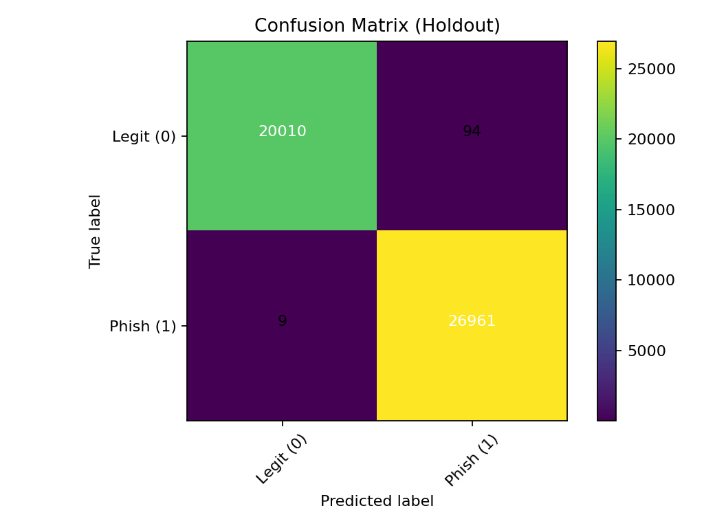
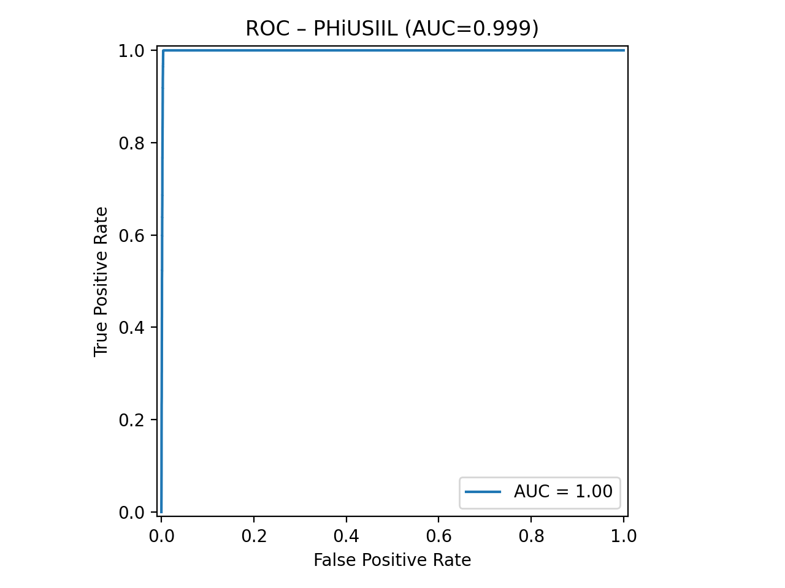

# Phishing URL Detector (Prototype)

Prototyp zur Erkennung von **Phishing-Webseiten** auf Basis von **URL-String-Features** (lexikalische Merkmale)
Implementiert in **Python + scikit-learn**. (mit URL-String-Features)

## Projektbeschreibung

Dieses Projekt implementiert und evaluiert eine schlanke Machine-Learning-Pipeline, um 
URLs als **Phishing (1)** oder **Legitim (0)** zu klassifizieren.  

Das Ziel ist es, ein reproduzierbares Basissystem bereitzustellen, das zeigt, wie effektiv 
rein stringbasierte Merkmale von URLs für die Phishing-Erkennung eingesetzt werden können.  

Das Projekt wurde im Rahmen meiner Masterarbeit entwickelt.

---

## Technologien

- **Python 3.10+**
- **scikit-learn**      : Machine-Learning-Modelle & Evaluation
- **pandas, numpy**     : Datenverarbeitung
- **matplotlib**        : Visualisierungen
- **pytest**            : Unit-Tests
- **GitHub Actions**    : Continuous Integration (Tests + Linting)


## 1) Setup

```bash
# Optional: ins Projekt wechseln
cd phishing-detector

# (a) Virtuelle Umgebung
python -m venv .venv
# Windows: .venv\Scripts\activate
# macOS/Linux:
source .venv/bin/activate

# (b) Abhängigkeiten
pip install -r requirements.txt
```

## 2) Daten vorbereiten

Lege eine CSV-Datei in `data/raw/` mit **Spaltennamen genau**: `url,label`  
- `url` = vollständige URL als String  
- `label` = 1 (phishing) oder 0 (legitim)

Für einen Smoke-Test ist eine **Mini-Beispieldatei** vorhanden: `data/raw/sample_urls.csv` (nur Demo).

## 3) Training & Evaluation

```bash
# Standard-Training (train/test + 5-fold CV):
python -m src.train --data data/raw/sample_urls.csv --outdir artifacts

# Optional mit Plots (Konfusionsmatrix etc.):
python -m src.train --data data/raw/sample_urls.csv --outdir artifacts --plots
```

Ausgaben:
- `artifacts/metrics.json` — Accuracy/Precision/Recall/F1/ROC-AUC (CV und Holdout)
- `artifacts/best_model.joblib` — bestes Modell (nach F1-score auf CV)
- `artifacts/feature_names.json` — verwendete Feature-Liste
- ggf. `artifacts/confusion_matrix.png`

## 4) Vorhersage

Einzeln oder als Batch:

```bash
# Einzel-URLs
python -m src.predict --model artifacts/best_model.joblib --urls https://example.com http://login-secure-update-account.com

# CSV-Batch (Spalte: url)
python -m src.predict --model artifacts/best_model.joblib --input_csv data/raw/sample_urls.csv
```

## 5) Hinweise

- **Reproduzierbarkeit**: fester `random_state=42`.  
- **Klassengewicht**: Modelle nutzen `class_weight='balanced'` (soweit verfügbar).  
- **Nur URL-Features**: Keine Inhalte, keine WHOIS – konform mit deiner Abgrenzung.  
- **Austausch des Datensatzes**: Ersetze `sample_urls.csv` durch deinen echten Datensatz (gleiche Spalten).  
- **Modelle**: LogisticRegression, SVM (RBF), RandomForest, GradientBoosting — alle aus scikit-learn.  
- **Metriken**: Accuracy, Precision, Recall, F1, ROC-AUC; zusätzlich Konfusionsmatrix auf Holdout.

## 6) Tests

```bash
pytest -q
```

## 7) Ordnerstruktur

```
phishing-detector/
├─ src/
│  ├─ features.py          # URL-Feature-Engineering
│  ├─ data.py              # CSV-Lader & Validierung
│  ├─ models.py            # Modell-Pipelines
│  ├─ train.py             # Training/Evaluierung/Speichern
│  ├─ predict.py           # CLI-Inferenz
│  └─ utils.py             # Seed, Logging
├─ data/
│  ├─ raw/                 # Eingabedaten (CSV mit url,label)
│  └─ processed/           # (optional) Vorverarbeitete Daten
├─ artifacts/              # Modelle, Metriken, Plots
├─ tests/                  # Unit-Tests (Features)
├─ notebooks/              # Platzhalter für EDA
├─ requirements.txt
├─ README.md
└─ .gitignore
```

## 8) Datensätze 

Als Hauptdatensatz wurde das „PhiUSIIL Phishing URL Dataset” von der Internetseite Kaggle verwendet.
- **PhiUSIIL Phishing URL Dataset** (Kaggle): 
  [Link](https://www.kaggle.com/code/latif8/phiusiil-phishing-url-datamining-project)

Zusätzlich zum „PhiUSIIL Phishing URL Dataset” von Kaggle wurde ein weiterer Datensatz mit vordefinierten Merkmalen für das Training und die Evaluierung des Prototyps verwendet. Dieser Datensatz stammt aus dem UCI Machine Learning Repository und besteht aus dem „Phishing Website Dataset” von der Internetseite Kaggle.
- **Phishing Website Dataset** (UCI Repository, gespiegelt auf Kaggle): 
  [Link](https://www.kaggle.com/discussions/general/203311)


## 9) Visualisierungen

Konfusionsmatrix:



ROC-Kurve:



Die gezeigten Visualisierungen basieren auf dem **PhiUSIIL Phishing URL Dataset** von Kaggle.  
Quelle: [Kaggle – PhiUSIIL Phishing URL Datamining Project](https://www.kaggle.com/code/latif8/phiusiil-phishing-url-datamining-project)


## 10) Highlights

- End-to-End ML-Pipeline für Phishing-Erkennung  
- Vergleich klassischer ML-Modelle (LogReg, SVM, RF, GB)  
- Automatisierte Evaluation & Visualisierungen  
- Reproduzierbar mit Demo-Datensatz + Kaggle-Daten  
- Entwickelt im Rahmen einer Masterarbeit


## Lizenz
MIT License
